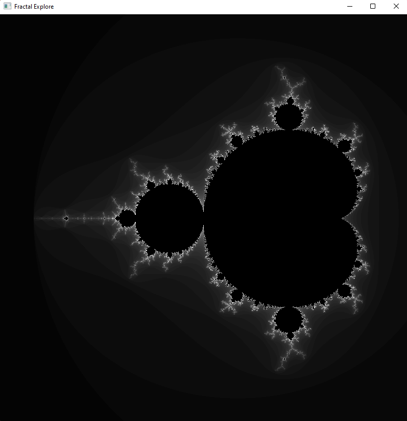

# FractalExplore

#### Description
This project is the successor to my other project FractalGenerator. A simple window application that allows a user to view the marvels of fractal images in real time using shaders. The user can freely roam the intricate details of fractals by zooming and scrolling. Currently there is only support for rendering the Mandelbrot Set but there are plans to include other fractals, as well as introducing different visualisation schemes.

#### Usage
This project was built on a Windows 11 machine, using MinGW. To build the project on Windows do the following:
```
cmake . -G "MinGW Makefiles"
mingw32-make
```
The program can then be executed by running the file **run.exe**
<!--  -->

#### Reasoning
I started this project to learn how to build window based applications in C. I have always been interested in computer graphics and the technology related to it. A problem faced by the predecessor of this project **FractalGenerator** was the time that was required to compute just a single frame of a fractal. It would take several minutes to produce a still image even with parallelisation of the task. To improve the time taken to compute fractal images, I had to learn how to use the power of programming on the graphics card. Using GLSL shaders in OpenGL I could compute fractal images in real-time. 
